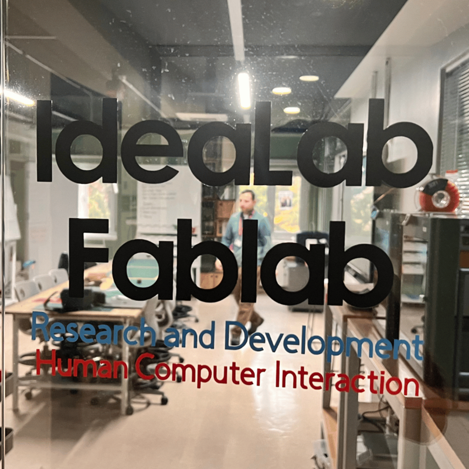

**[home](https://badebasligil.github.io/badebasligil/)** | **[projects](project.md)** | **[big ideas](big_ideas.md)** | **[resources](resources.md)**

# ****

## **GitHub Pages**

GitHub Pages is a free and powerful platform that allows software developers and content creators to promote their projects, share their documentation, and publish their personal portfolios.

 

### **Bade Başlıgil Hisar CSP, Idealab**

## **My Mentor**

 

