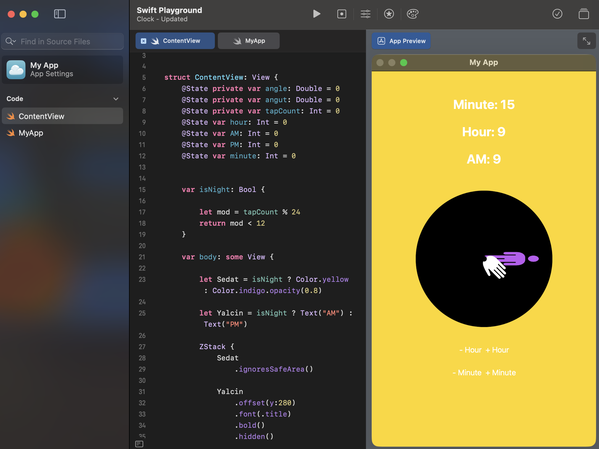

**[home](https://badebasligil.github.io/badebasligil/)** | **[projects](project.md)** | **[big ideas](big_ideas.md)** | **[resources](resources.md)**

# **[Projects:](https://github.com/badebasligil/badebasligil/tree/main/Project)**

 

### **[Swift Playground - 9 Boxes](https://github.com/badebasligil/badebasligil/tree/main/Project/Swift_Playground)**

- *A bunch of colorful boxes, some marked with X some with O*

  

 
### **[Swift Playground - Calculator](https://github.com/badebasligil/badebasligil/blob/main/Project/Swift_Playground/Calculator%20-%20Swift%20App.swiftpm.zip)**

- *A calculator app that gets user input and does calculations on them.*

  

**[The Codes with the Comments](https://github.com/badebasligil/badebasligil/blob/main/Project/Swift_Playground/Calculator_App_Codes_with_Comments)**
 

### **[Scratch - Tic Tac Toe](https://github.com/badebasligil/badebasligil/tree/main/Project/Block_Coding)**

- *A basic Tic-Tac-Toe game*

  

### **[Clock-Version 2](https://github.com/badebasligil/badebasligil/blob/main/Project/Swift_Playground/Clock%20-%20Updated.swiftpm.zip)**

- *A clock app that changes the hour and/or the minute once the screen or buttons are clicked, shows the hour and minutes and determines wether it is AM or PM*

- *[The Codes](https://github.com/badebasligil/badebasligil/blob/main/Project/Swift_Playground/Clock_Updated_Codes)*

 

### **[Clock-Version 3](https://github.com/badebasligil/badebasligil/blob/main/Project/Clock%20v3.swiftpm.zip)**

- *A clock app that changes the hour and/or the minute once the screen or buttons are clicked, shows the hour and minutes and determines wether it is AM or PM, the clock is also shaped like a bear and the pose of the bear changes according to the hours of the day*

- *[The Codes](https://github.com/badebasligil/badebasligil/blob/main/Project/Swift_Playground/clock_v3_codes)*

 

 

 

* https://drive.google.com/drive/folders/1BOemroFw7UygbUy6W5WKSnsG5aAJTx2A *

- *Target Audience: ages 2-8*

- * Why?: because there are many different designs out there for kids at that age but none actually represent the mood of the hours in a friendly way. *

- *How do your design choices support this audience?: for instance, once the clock hits 8 PM the bear starts to sleep representing 'sleep time' for the kids, during the morning it wakes up, etc.*

- *How did research (FigJam) influence your design?: me and my partner didn't know what kind of design to do on the clock to make it more appealing to kids, the research (Figjam) helped us decide on that.*

- *What was the most challenging part of coding?: coding the costume changes depending on the time was the hardest part*
 
 

# **[Practice Projects](https://github.com/badebasligil/badebasligil/tree/main/Project/Practice_Swift_Playground_Projects)**

### **[Menu-Bill](https://github.com/badebasligil/badebasligil/blob/main/Project/Practice_Swift_Playground_Projects/Menu-Bill)**

- *A code that gives the cost of a bill of an order*

### **[Me - Created by codes](https://github.com/badebasligil/badebasligil/blob/main/Project/Practice_Swift_Playground_Projects/My%20App%20copy%204.swiftpm.zip)**

- *A version of me created by codes*

- *[The Codes](https://github.com/badebasligil/badebasligil/blob/main/Project/Practice_Swift_Playground_Projects/Me_Codes)*

   

### **[Clock - Version 1](https://github.com/badebasligil/badebasligil/blob/main/Project/Swift_Playground/Clock%3F.swiftpm.zip)**

- *A clock app that changes the hour once the screen is clicked, shows the hour and determines wether it is AM or PM*

- *[The Codes](https://github.com/badebasligil/badebasligil/blob/main/Project/Swift_Playground/Clock%3F_Codes)*

   
